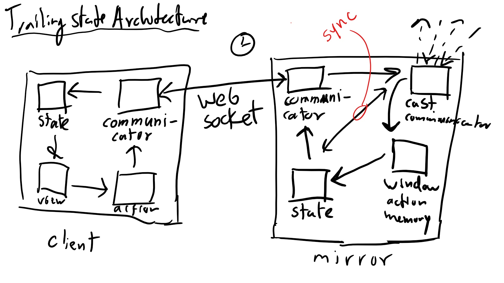
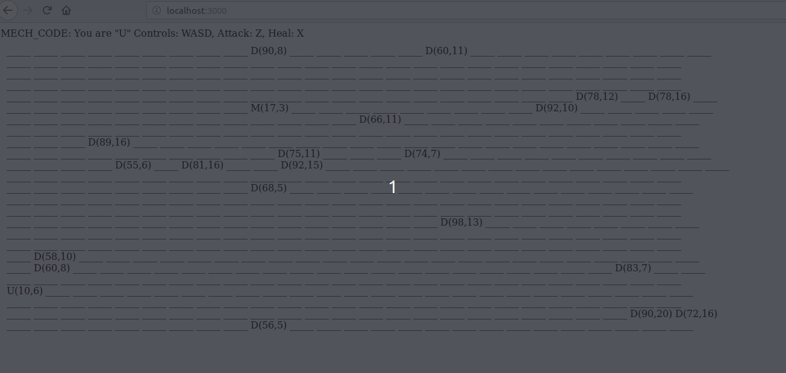

# MECH_CODE

Our solution for practical assignment B of the distributed computing systems course @Tu Delft. The purpose is to create a distributed game server that is fault tolerant due to the replication of the state over multiple instances.

There are two applications. The `mirror server` that handles the logic of a mirror server running the mech code game and
that can serve a webpage and a socket connection to play the game. The other application, `clientagent` is very small and
is used to simulate a user. It connects to the `mirror` server with a websocket.

The web client looks as follows:

- U (You) is your character.
- M (Mech) are the other characters.
- D (Dragon) are the monsters that need to be slain.
- (Health, Hitpoints)

## Get packages

`cd mirror && npm install`

## Test

`cd mirror && npm test`

## Run

To run the mirror server: `cd mirror && npm start`
To run the client agents: `cd clientagent && npm start`
